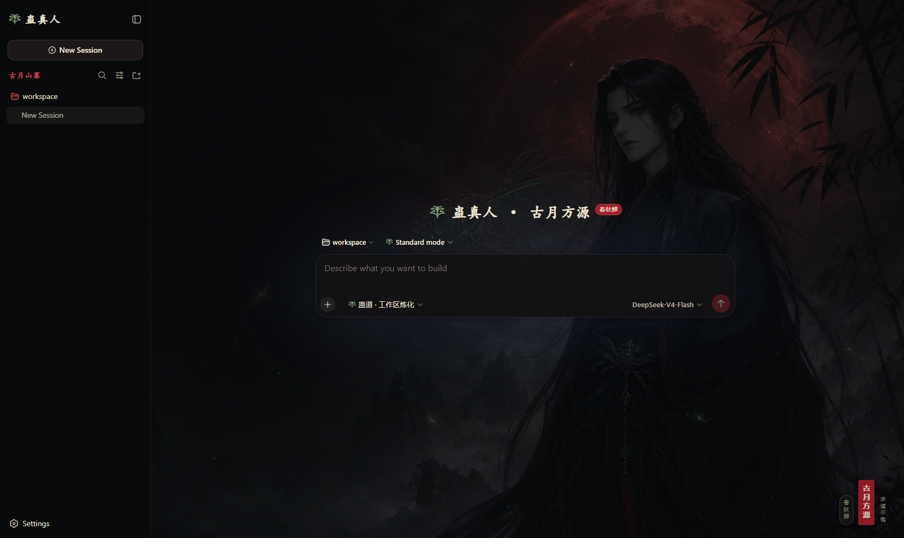

# dsh_bug_style

English | [中文](README.zh.md)



An opt-in **蛊真人 / 古月方源** visual plugin for DeepSeek Harness. This repository contains only the plugin source, its original background artwork, a clean preview screenshot, and one integration patch; it does not mirror the full DeepSeek Harness repository.

## What it adds

- A blood-moon Fang Yuan background with translucent ink surfaces.
- `蛊真人` wordmark and cicada symbol in the sidebar.
- `蛊真人 · 古月方源` hero identity with a `春秋蝉` badge.
- Cicada icon beside the live Agent preset name. The button continues to show the actual Standard, PTC, or user-authored mode; its menu and selection behavior are unchanged.
- `蛊道 · 工作区炼化` on the access-mode selector and `古月山寨` on the workspace section.
- Reduced-motion and narrow-viewport handling, with original accessible labels preserved.

## Use it in a DeepSeek Harness checkout

The target checkout must be a compatible DeepSeek Harness source tree. From its repository root:

```powershell
git apply deepseek-harness-fang-yuan.patch
pnpm install
pnpm run build
pnpm dsh --profile web --patch examples/web-fang-yuan/cordis.yml
```

The patch keeps the theme row disabled in the shipped Web profile. The `examples/web-fang-yuan/cordis.yml` overlay enables it explicitly, so the ordinary UI remains unchanged until you opt in. Opening the interface needs no model credential; model prompts keep the ordinary Web profile's credential requirements.

The same switch can be made durable in a user's Web profile by adding this row to `$DSH_HOME/profiles/web/cordis.patch.yml`:

```yaml
- id: ui-fang-yuan-theme
  disabled: false
```

## Repository contents

- [`plugin/`](plugin/README.md) — the standalone package source copied from `@deepseek-ai/dsh-client-ui-fang-yuan-theme`.
- [`deepseek-harness-fang-yuan.patch`](deepseek-harness-fang-yuan.patch) — the plugin-only integration patch for an existing Harness checkout.
- [`assets/fang-yuan-background.webp`](assets/fang-yuan-background.webp) — the original generated background artwork.
- [`assets/fang-yuan-theme-preview.png`](assets/fang-yuan-theme-preview.png) — a clean screenshot from the real keyless Web composition.

The custom theme id is process-local. Choosing a built-in Light, Dark, or System theme while the plugin remains loaded makes that built-in choice active; reload or remount the plugin to activate Fang Yuan again.
